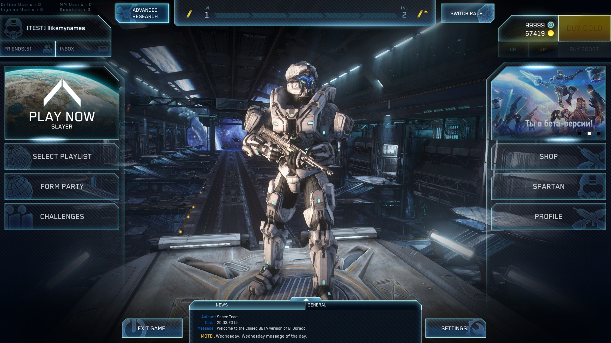
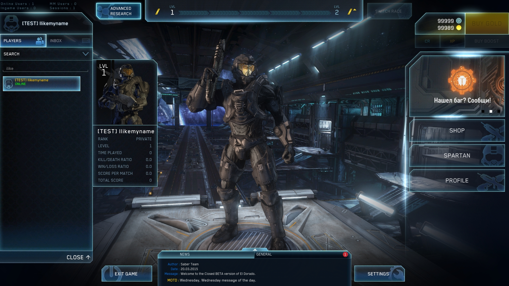
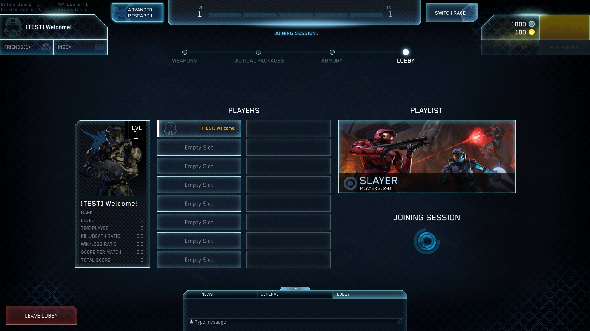

# Halal-Station-Remastered

#### USERS CAN NOW PROPERLY LOGIN AND WONT FACE ANY PROBLEMS, BUT SHOPS AND SUCH WILL BE EMPTY ATM WHILST I ADD ALL THE TITLE INSTANCES.
## TODO for the API:
#### EndpointsDispatcherService.svc
- ~~GetAuthorizationEndpointsAndDate~~
#### AuthorizationService.svc
- ~~SignIn~~
#### FriendsService.svc
- ~~GetSubscriptions~~
- ~~SubscriptionAdd~~
- ~~SubscriptionRemove~~
#### GameStatisticsService.svc
- ~~GetUserChallenges~~
- ~~CheckNewUserChallenges~~
#### HeartbeatService.svc
- ~~GetServicesStatus~~
#### PresenceService.svc
- ~~PresenceConnect~~
- ~~ReportOnlineStats~~
- ~~PartyGetStatus~~
- ~~GetPlaylistStats~~
- ~~PresenceGetUsersPresence~~
- ~~PartySetGameData~~
- PartyJoin
- ~~PartyLeave~~
- ~~MatchmakeGetStatus~~
- ~~MatchmakeStart~~
- ~~MatchmakeStop~~
#### MessagingService.svc
- ~~JoinChannels~~
- ~~Receive~~
- ~~LeaveChannels~~
- ~~Send~~
### ArbitraryStorageService.svc
- ~~WriteDiagnosticsData~~
- ~~WriteADFPack~~
#### TitleResourceService.svc
- ~~GetTitleConfiguration~~
- ~~GetTitleTagsPatchConfiguration~~
#### UserService.svc
- ~~GetUserStates~~
- ~~GetShop~~
- ~~GetItemOffers~~
- ~~GetTransactionHistory~~
- ~~GetUsersBaseData~~
- ~~GetUsersPrimaryStates~~
- ~~GetUsersByNickname~~
- ApplyOfferListAndGetTransactionHistory
- ~~NicknameChange~~
#### UserStorageService.svc
- ~~GetPublicData~~
- ~~GetPrivateData~~
- ~~SetPublicData~~
- ~~SetPrivateData~~
#### SessionControlService.svc
- ~~ClientGetStatus~~

## CURRENT MAINMENU

#### There is still many fixes and addons to implement, so please be patient.